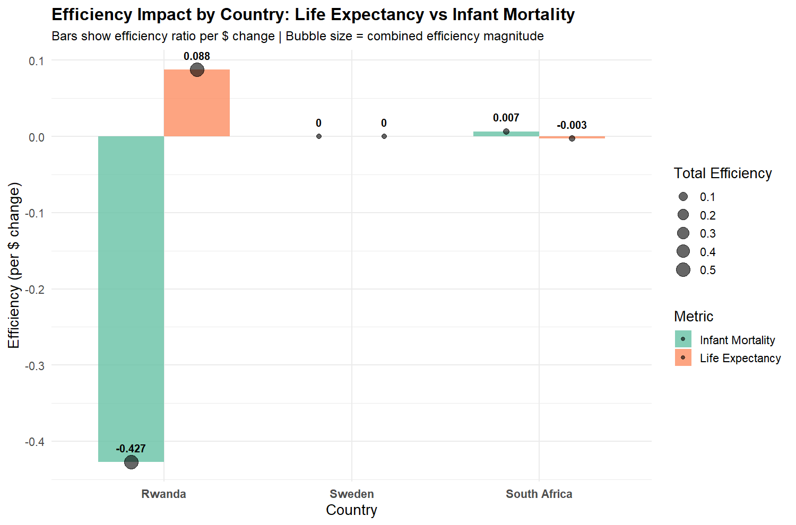

# Data Analytics Portfolio

Welcome to my data analytics portfolio. This repository contains my projects, case studies, and analyses.

## Featured Projects

### 1. Healthcare Efficiency: Rwanda, South Africa and Sweden (2005–2020)
**Goal:** Compare how effectively different countries convert healthcare spending into outcomes.

[Read the full analysis](Sweden_Rwanda_ZAR_healthcare.md)  

**Data sources:** World Bank (health expenditure, GDP, population)  
Preview chart:  
**
